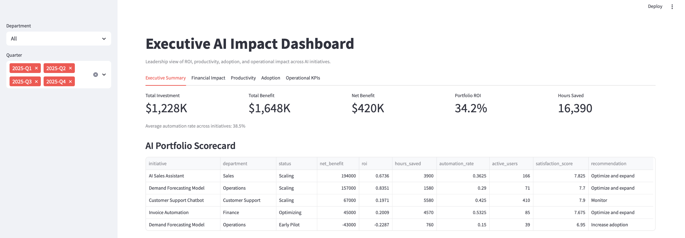
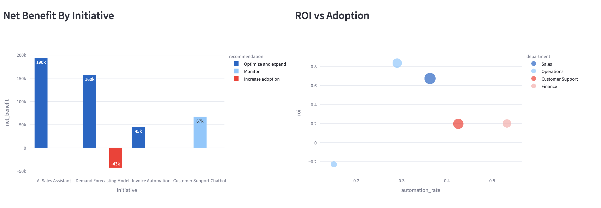
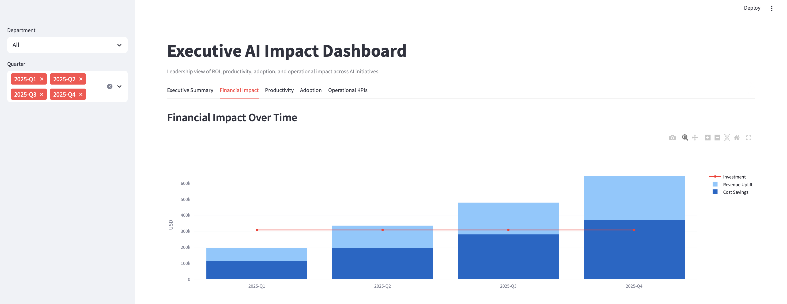
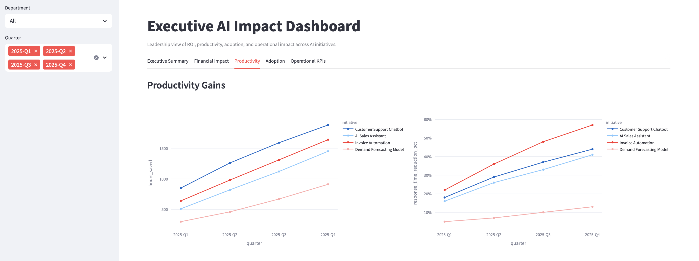
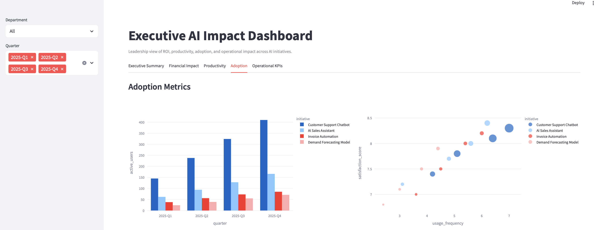
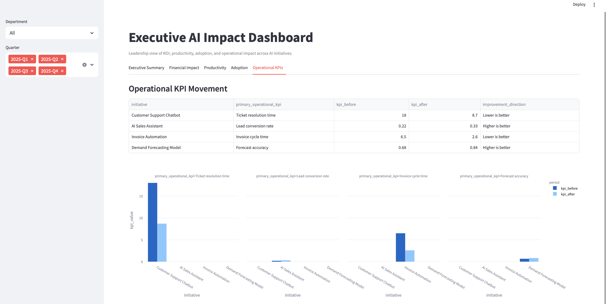

# Executive AI Impact Dashboard

## Project Overview

Executive AI Impact Dashboard is a leadership dashboard that shows how executives can monitor whether AI transformation initiatives are creating measurable business value.

The scenario assumes a company has implemented multiple AI initiatives across the business:

- Customer support chatbot
- AI sales assistant
- Invoice automation
- Demand forecasting model

Management wants visibility into ROI, productivity gains, adoption, cost savings, and operational KPI improvement.

## Business Question

How can leadership decide whether AI investments are working?

This project shifts the focus from building one AI model to measuring the portfolio-level business impact of AI initiatives.

## Dashboard Sections

| Section | Metrics |
| --- | --- |
| Financial Impact | Cost reduction, revenue uplift, ROI, payback period |
| Productivity | Hours saved, automation rate, response time reduction |
| Adoption Metrics | Active users, usage frequency, satisfaction score |
| Operational KPIs | Ticket resolution, sales conversion, invoice cycle time, forecast accuracy |

## Dashboard Screenshots

### Executive Summary





### Financial Impact



### Productivity



### Adoption



### Operational KPIs



## Data

This project uses synthetic enterprise AI initiative data. Synthetic data is appropriate for this scenario because many companies use simulated or anonymized internal data when planning AI business cases and executive dashboards.

## Tools

- Python
- Streamlit
- pandas
- Plotly
- Synthetic enterprise KPI data

## Quick Start

```bash
git clone https://github.com/Jidapaneon/Executive-AI-Impact-Dashboard.git
cd Executive-AI-Impact-Dashboard
python3 -m venv .venv
source .venv/bin/activate
pip install -r requirements.txt
streamlit run src/app.py
```

Then open the local Streamlit URL shown in the terminal, usually:

```text
http://localhost:8501
```

## Why This Project Matters

Many AI portfolios focus on model output, but executives need to understand business outcomes. This dashboard demonstrates how AI impact can be measured through ROI, adoption, productivity, cost savings, and operational performance.
