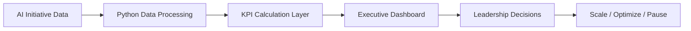

# Architecture

## Data Flow

1. AI initiative data is collected from synthetic enterprise sources.
2. Python calculates financial, productivity, adoption, and operational KPIs.
3. Streamlit displays portfolio-level and initiative-level dashboard views.
4. Executives use the dashboard to decide which AI initiatives should scale, improve, or stop.

